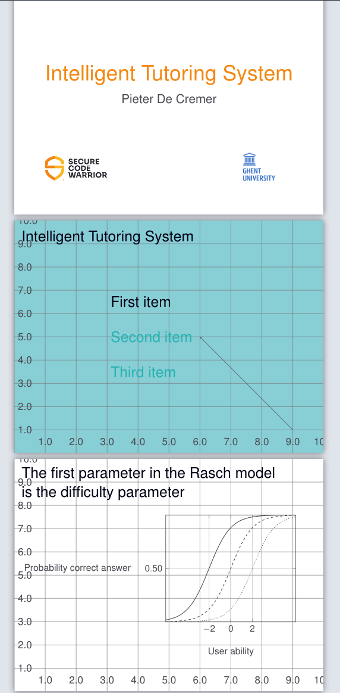

# latex-beamer-grid-layout
Grid layout system to more easily create presentations in LaTeX, also includes Secure Code Warrior Branding

## Usage

Load style into your project
```latex
\usepackage{grid}
```

The style loads in Secure Code Warrior colors:
- scw-blue-black
- scw-charcoal
- scw-orange
- scw-yellow
- scw-white
- scw-ivory
- scw-red
- scw-sky
- scw-teal

The grid layout is made with a tikzpicture.
Enable help lines with `\HelpLinestrue`.

Add things to your slides with the following commands:

`\PlaceAt` takes 3 arguments and is essentially a wrapper for a `\node`
1. coordinates in percentages of `\paperwidth` and `\paperheight` in `()`
2. (Optional) arguments to the `\node` in the tikzpicture in `[]` (for example `right` to place the text on the right of the chose coordinates instead of centered on them)
3. The contents of the node in `{}`


`\AddToPlaced` is a wrapper to place anything other than `\node` to the tikzpicture

## Example



```latex

\documentclass[12pt]{beamer}
\usepackage{grid}
\def\MyAuthor{Pieter De Cremer}
\def\MyTitle{Intelligent Tutoring System}

\begin{document}
%% TITLE
\begin{frame}
  \PlaceAt(.5,.6)[]{\textcolor{scw-orange}{\Huge \MyTitle}}
  \PlaceAt(.5,.5)[]{\large \MyAuthor}
  \PlaceAt(0.2,0.2){\includegraphics[width=.2\paperwidth]{logos/SCW_logo_primary_RGB_300ppi.png}}
  \PlaceAt(0.8,0.2){\includegraphics[width=.2\paperwidth]{logos/logo_UGent_EN_RGB_2400_color.png}}
\end{frame}

\HelpLinestrue
{
\setbeamercolor{background canvas}{bg=scw-sky}
\begin{frame}{\MyTitle}
  \PlaceAt(.3,.65)[right]{\Large \textcolor{scw-blue-black}{First item}}
  \PlaceAt(.3,.5)[right] {\Large \textcolor{scw-teal}{Second item}}
  \PlaceAt(.3,.35)[right]{\Large \textcolor{scw-teal}{Third item}}

  % some arrow for fun
  \AddToPlaced{\draw[->] (.9\paperwidth,.1\paperheight) -- (.6\paperwidth,.5\paperheight);}
\end{frame}
}

\begin{frame}{The first parameter in the Rasch model\\ is the difficulty parameter}
  \PlaceAt(.02,.53)[right]{\small Probability correct answer}
  \PlaceAt(.7,.17){\small User ability}

  \PlaceAt(.4,.5)[right]{
    \begin{tikzpicture}[scale=0.9]
    \input{plots/1pl}
    \end{tikzpicture}
  }
\end{frame}

...
```
